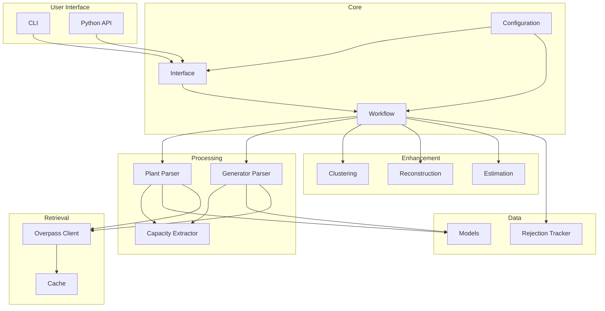
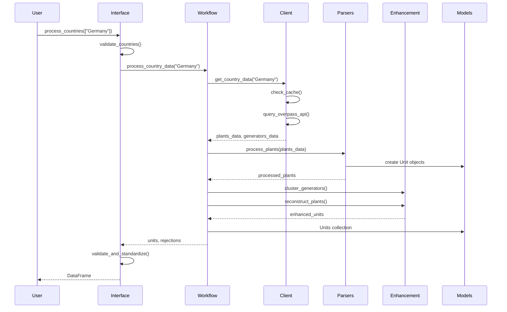

# Architecture

This document describes the internal architecture of OSM Power Plants.

## Package Structure

```txt
osm-powerplants/
├── __init__.py          # Public API exports
├── cli.py               # Command-line interface
├── core.py              # Configuration and paths
├── interface.py         # High-level processing API
├── models.py            # Data models (Unit, Units, PlantGeometry)
├── utils.py             # Utility functions
├── workflow.py          # Processing pipeline orchestration
├── enhancement/         # Data enhancement modules
│   ├── clustering.py    # Generator clustering (DBSCAN)
│   ├── estimation.py    # Capacity estimation
│   ├── geometry.py      # Geometric operations
│   └── reconstruction.py # Plant reconstruction from generators
├── parsing/             # OSM element parsing
│   ├── base.py          # Base parser with tag extraction
│   ├── capacity.py      # Capacity value parsing
│   ├── factory.py       # Parser factory pattern
│   ├── generators.py    # Generator element parser
│   └── plants.py        # Plant relation parser
├── quality/             # Data quality tracking
│   └── rejection.py     # Rejection tracking
└── retrieval/           # Data retrieval
    ├── cache.py         # Multi-level caching
    ├── client.py        # Overpass API client
    └── regional.py      # Regional queries
```

## Component Diagram



## Data Flow



## Key Classes

### Unit

The core data structure representing a power plant:

```python
@dataclass
class Unit:
    projectID: str
    Country: str | None = None
    lat: float | None = None
    lon: float | None = None
    Fueltype: str | None = None
    Technology: str | None = None
    Capacity: float | None = None
    Name: str | None = None
    Set: str | None = None
    DateIn: int | None = None
    # ... metadata fields
```

### Units

Collection class with filtering and export:

```python
class Units:
    def add_unit(self, unit: Unit) -> None
    def filter_by_country(self, country: str) -> Units
    def filter_by_fueltype(self, fueltype: str) -> Units
    def get_statistics(self) -> dict
    def to_dataframe(self) -> pd.DataFrame
    def save_csv(self, path: str) -> None
    def save_geojson_report(self, path: str) -> None
```

### Workflow

Orchestrates the processing pipeline:

```python
class Workflow:
    def __init__(self, client, rejection_tracker, units, config)
    def process_country_data(self, country: str) -> tuple[Units, RejectionTracker]
```

### OverpassAPIClient

Handles API communication and caching:

```python
class OverpassAPIClient:
    def get_country_data(self, country, force_refresh, plants_only)
    def get_plants_data(self, country, force_refresh)
    def get_generators_data(self, country, force_refresh)
    def query_overpass(self, query: str) -> dict
```

## Processing Pipeline

### 1. Country Validation

```python
validate_countries(["Germany", "France"])
# Returns: (["Germany", "France"], {"Germany": "DE", "France": "FR"})
```

### 2. Data Retrieval

The client fetches data from Overpass API:

```sql
[out:json][timeout:300];
area["ISO3166-1"="DE"][admin_level=2]->.boundaryarea;
(
    node["power"="plant"](area.boundaryarea);
    way["power"="plant"](area.boundaryarea);
    relation["power"="plant"](area.boundaryarea);
);
out body;
```

### 3. Element Parsing

Each OSM element is parsed to extract:

- Coordinates (from nodes, way centroids, or relation centroids)
- Fuel type (from `plant:source` or `generator:source` tags)
- Technology (from `plant:method` or `generator:method` tags)
- Capacity (from `*:output:electricity` tags)
- Name and commissioning date

### 4. Enhancement

Optional post-processing steps:

- **Clustering**: Group nearby generators (solar/wind farms)
- **Reconstruction**: Aggregate orphaned generators into plants
- **Estimation**: Estimate capacity from geometry

### 5. Validation

Final validation ensures:

- Valid fuel types (from allowed list)
- Valid technologies (from allowed list)
- Valid set types (PP, Store, CHP)

## Extension Points

### Custom Parsers

Extend `BaseParser` to add custom parsing logic:

```python
from osm_powerplants.parsing.base import BaseParser

class CustomParser(BaseParser):
    def process_element(self, element, country, processed_ids):
        # Custom logic
        return unit
```

### Custom Enhancement

Add new enhancement modules:

```python
from osm_powerplants.models import Unit

def custom_enhancement(units: list[Unit], config: dict) -> list[Unit]:
    # Custom enhancement logic
    return enhanced_units
```

### Custom Rejection Reasons

Extend the rejection tracking:

```python
from osm_powerplants.models import RejectionReason

# Add to enum if needed
class CustomRejectionReason(RejectionReason):
    CUSTOM_REASON = "Custom rejection reason"
```
