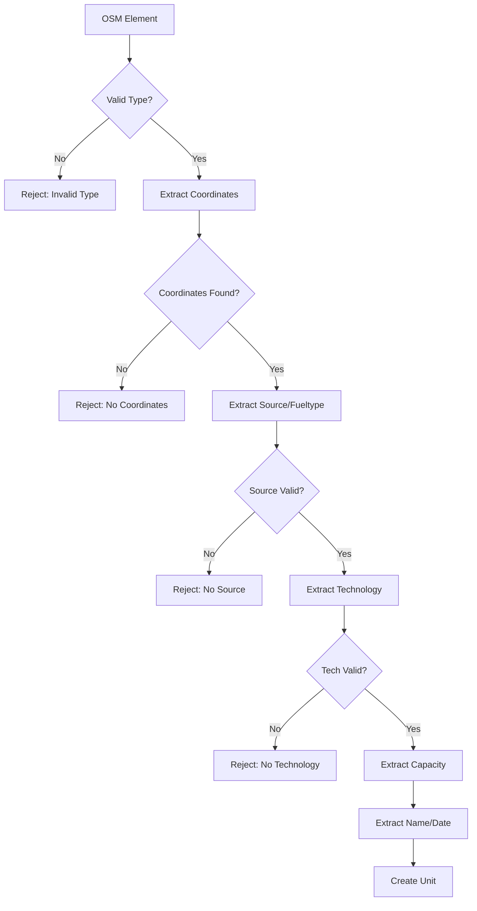
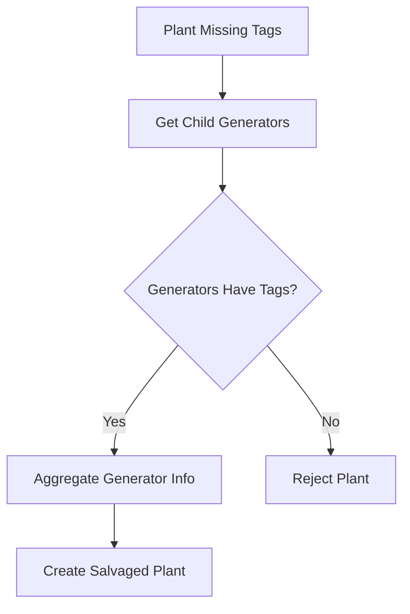

# Processing Pipeline

This document details the step-by-step processing pipeline for extracting power plant data from OpenStreetMap.

## Pipeline Overview


## Step 1: Country Validation

The pipeline begins with validating country names:

```python
from osm_powerplants.interface import validate_countries

valid, codes = validate_countries(["Germany", "France", "Typo"])
```

**Process:**

1. Look up each country using `pycountry`
2. Support multiple formats (name, ISO-2, ISO-3)
3. Handle common variations (USA → United States)
4. Provide suggestions for typos

**Output:**

- List of valid country names
- Mapping to ISO-2 codes
- `ValueError` with suggestions if invalid

## Step 2: Data Retrieval

### 2.1 Check Cache Hierarchy

```python
# Level 1: CSV cache
if csv_cache_exists and config_matches:
    return cached_df

# Level 2: Units cache
if units_cache_exists and config_matches:
    return process_from_units_cache()

# Level 3: API cache
if api_cache_exists:
    return process_from_api_cache()

# Level 4: Fresh API query
return query_overpass_api()
```

### 2.2 Overpass API Query

For each country, the client executes:

```sql
[out:json][timeout:300];
area["ISO3166-1"="DE"][admin_level=2]->.boundaryarea;
(
    node["power"="plant"](area.boundaryarea);
    way["power"="plant"](area.boundaryarea);
    relation["power"="plant"](area.boundaryarea);
);
out body;
```

### 2.3 Dependency Resolution

OSM elements reference other elements:

- **Ways** reference **nodes** (for coordinates)
- **Relations** reference **ways** and **nodes** (for members)

The client automatically fetches these dependencies:

```python
# Fetch referenced nodes
uncached_nodes = [n for n in way["nodes"] if not cache.get_node(n)]
client.get_nodes(uncached_nodes)

# Fetch relation members
for member in relation["members"]:
    if member["type"] == "way":
        client.get_ways([member["ref"]])
```

## Step 3: Element Parsing

### 3.1 Plant Parsing

Each `power=plant` element goes through:



### 3.2 Tag Extraction

The parser looks for tags in priority order:

**Fuel Type:**

```python
source_tags = ["plant:source", "generator:source"]
for tag in source_tags:
    if tag in element["tags"]:
        return map_to_fueltype(element["tags"][tag])
```

**Technology:**

```python
tech_tags = ["plant:method", "plant:type", "site"]
for tag in tech_tags:
    if tag in element["tags"]:
        return map_to_technology(element["tags"][tag])
```

**Capacity:**

```python
output_tags = ["plant:output:electricity"]
for tag in output_tags:
    if tag in element["tags"]:
        return parse_capacity(element["tags"][tag])
```

### 3.3 Capacity Parsing

Handles various formats:

| Input | Output (MW) |
|-------|-------------|
| `50 MW` | 50.0 |
| `1.5GW` | 1500.0 |
| `100kWp` | 0.1 |
| `500 MWel` | 500.0 |

```python
def parse_capacity_value(value: str, advanced: bool) -> tuple[bool, float, str]:
    # Handle comma as decimal separator
    # Match regex patterns
    # Convert units to MW
    return success, capacity_mw, original
```

### 3.4 Coordinate Extraction

Different strategies per element type:

**Nodes:** Direct lat/lon

**Ways:** Calculate centroid from node coordinates

```python
coords = [get_node_coords(n) for n in way["nodes"]]
centroid = calculate_centroid(coords)
```

**Relations:** Build polygon from member ways

```python
polygon = build_polygon_from_members(relation["members"])
centroid = polygon.centroid
```

## Step 4: Enhancement

### 4.1 Plant Reconstruction

When a plant relation lacks source/technology but contains generators:



```python
# Example: Salvaged plant with 47 generators
"Salvaged plant 10166304 with 47 generators, capacity: 150.90 MW"
```

### 4.2 Generator Clustering

For solar and wind farms, nearby generators are clustered:

```python
from sklearn.cluster import DBSCAN

clustering_config = {
    "Solar": {"eps": 0.005, "min_samples": 2},
    "Wind": {"eps": 0.02, "min_samples": 2}
}

clusterer = DBSCAN(eps=config["eps"], min_samples=config["min_samples"])
labels = clusterer.fit_predict(coordinates)
```

### 4.3 Capacity Estimation

When enabled, estimate capacity from geometry:

```python
# Solar: area-based estimation
capacity_mw = area_m2 * efficiency_w_per_m2 / 1_000_000

# Default efficiency: 150 W/m²
```

## Step 5: Final Validation

### 5.1 Value Validation

```python
VALID_FUELTYPES = ["Nuclear", "Solar", "Wind", "Hydro", ...]
VALID_TECHNOLOGIES = ["PV", "Onshore", "Run-Of-River", ...]
VALID_SETS = ["PP", "Store", "CHP"]

# Log warnings for invalid values
if fueltype not in VALID_FUELTYPES:
    logger.warning(f"Invalid Fueltype: {fueltype}")
```

### 5.2 Column Standardization

Ensure all target columns exist:

```python
target_columns = [
    "projectID", "Name", "Country", "lat", "lon",
    "Fueltype", "Technology", "Set", "Capacity", "DateIn"
]

for col in target_columns:
    if col not in df.columns:
        df[col] = np.nan
```

### 5.3 Metadata Removal

Remove internal columns before export:

```python
metadata_columns = ["created_at", "config_hash", "config_version"]
df = df.drop(columns=metadata_columns, errors="ignore")
```

## Rejection Tracking

Throughout the pipeline, rejections are tracked:

```python
class RejectionReason(Enum):
    INVALID_ELEMENT_TYPE = "Invalid element type"
    COORDINATES_NOT_FOUND = "Could not determine coordinates"
    MISSING_TECHNOLOGY_TAG = "Missing technology tag"
    MISSING_SOURCE_TAG = "Missing source tag"
    CAPACITY_PLACEHOLDER = "Capacity placeholder value"
    # ... more reasons
```

**Example Summary:**

```bash
Rejection Summary:
Total rejections: 333
----------------------------------------
Capacity placeholder value: 155 (46.5%)
Missing output tag: 127 (38.1%)
Missing technology tag: 27 (8.1%)
```

## Performance Considerations

### Batch Processing

Elements are processed in batches to reduce API calls:

```python
# Fetch nodes in bulk
client.get_nodes(list_of_node_ids)  # Single API call for many nodes
```

### Progress Tracking

Long operations show progress:

```bash
Downloading Chile: 100%|██████████| 966/966 [00:04<00:00, 207.88elements/s]
```

### Memory Management

Large datasets are processed incrementally:

```python
for country in countries:
    country_df = process_country(country)
    all_data = pd.concat([all_data, country_df])
    # Country data can be garbage collected
```
