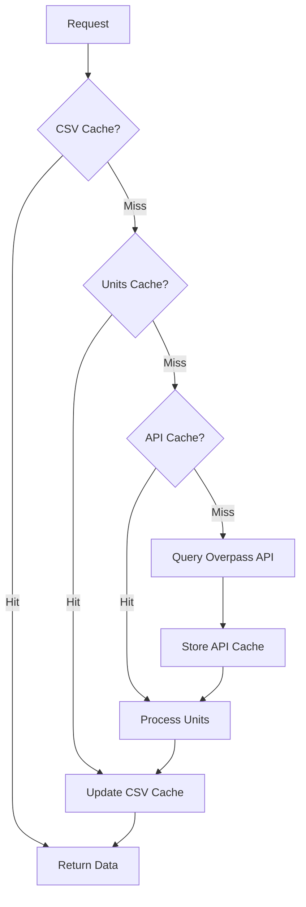

# Caching

OSM Power Plants uses a multi-level caching system to minimize API calls and speed up repeated queries.

## Cache Levels

The caching system has three levels, from fastest to slowest:



### Level 1: CSV Cache

**Location**: `{cache_dir}/osm_data.csv`

Stores the final processed output for each country. This is the fastest cache level.

- Contains fully processed and validated power plant data
- Includes a `config_hash` to detect configuration changes
- Updated automatically when processing completes

### Level 2: Units Cache

**Location**: `{cache_dir}/processed_units.json`

Stores processed `Unit` objects before CSV export.

- Faster than re-processing from API data
- Validated against current configuration
- Useful when output format changes but processing logic doesn't

### Level 3: API Cache

**Location**: `{cache_dir}/` (multiple files)

Stores raw OSM elements using [diskcache](https://github.com/grantjenks/python-diskcache):

| File/Directory | Content |
|----------------|---------|
| `plants_power.json` | Plant elements by country |
| `generators_power.json` | Generator elements by country |
| `nodes_dc/` | Individual OSM nodes |
| `ways_dc/` | Individual OSM ways |
| `relations_dc/` | Individual OSM relations |

## Cache Location

Default locations (using [platformdirs](https://github.com/platformdirs/platformdirs)):

| OS | Location |
|----|----------|
| Linux | `~/.cache/osm-powerplants/` |
| macOS | `~/Library/Caches/osm-powerplants/` |
| Windows | `C:\Users\<user>\AppData\Local\osm-powerplants\Cache\` |

### Custom Cache Location

Set in configuration:

```yaml
cache_dir: /path/to/custom/cache
```

Or at runtime:

```python
from osm_powerplants import get_config

config = get_config()
config["cache_dir"] = "/path/to/custom/cache"
```

## Cache Management

### Viewing Cache Status

```bash
osm-powerplants info
```

Output:

```bash
Cache directory: /home/user/.cache/osm-powerplants
Config loaded: True
  - force_refresh: False
  - plants_only: True
```

### Cache Size

Check cache size:

```bash
du -sh ~/.cache/osm-powerplants/
```

Typical sizes after processing several countries:

| Content | Typical Size |
|---------|--------------|
| CSV cache | 1-50 MB |
| Units cache | 5-100 MB |
| API cache | 20-500 MB |

### Forcing Cache Refresh

#### CLI

```bash
osm-powerplants process Germany --force-refresh -o germany.csv
```

#### Python

```python
from osm_powerplants import process_countries_simple, get_config, get_cache_dir

config = get_config()
config["force_refresh"] = True

df = process_countries_simple(
    countries=["Germany"],
    config=config,
    cache_dir=str(get_cache_dir(config)),
)
```

### Clearing Cache

#### Clear Everything

```bash
rm -rf ~/.cache/osm-powerplants/*
```

#### Clear Specific Country

```python
import pandas as pd
import os

cache_dir = os.path.expanduser("~/.cache/osm-powerplants")
csv_path = os.path.join(cache_dir, "osm_data.csv")

# Remove country from CSV cache
if os.path.exists(csv_path):
    df = pd.read_csv(csv_path)
    df = df[df["Country"] != "Germany"]
    df.to_csv(csv_path, index=False)
```

#### Clear API Cache Only

```bash
rm -rf ~/.cache/osm-powerplants/nodes_dc
rm -rf ~/.cache/osm-powerplants/ways_dc
rm -rf ~/.cache/osm-powerplants/relations_dc
rm ~/.cache/osm-powerplants/plants_power.json
rm ~/.cache/osm-powerplants/generators_power.json
```

## Configuration Hash

The caching system uses a configuration hash to detect when reprocessing is needed:

```python
from osm_powerplants.models import Unit

# Parameters that affect the hash
PROCESSING_PARAMETERS = [
    "capacity_extraction",
    "capacity_estimation",
    "units_clustering",
    "source_mapping",
    "technology_mapping",
    "source_technology_mapping",
    "plants_only",
    "missing_name_allowed",
    "missing_technology_allowed",
    "missing_start_date_allowed",
    "sources",
    "units_reconstruction",
]

# Generate hash
config_hash = Unit._generate_config_hash(config)
```

When configuration changes, cached data with different hashes is automatically invalidated.

## Cache Performance

### First Run (Cold Cache)

```bash
Processing Chile...
Downloading Chile: 100%|██████████| 966/966 [00:04<00:00]
Resolving 8877 uncached nodes...
Processing time: ~20 seconds
```

### Second Run (Warm Cache)

```bash
Processing Chile...
Using CSV cache for Chile (matching config)
Processing time: ~0.3 seconds
```

### Speedup by Cache Level

| Cache Hit | Typical Speedup |
|-----------|-----------------|
| CSV Cache | 50-100x |
| Units Cache | 10-30x |
| API Cache | 2-5x |

## Troubleshooting

### Corrupt Cache

If you encounter errors, try clearing the cache:

```bash
rm -rf ~/.cache/osm-powerplants/*
```

### Disk Space

The API cache can grow large. Set a size limit in configuration:

```yaml
overpass_api:
  cache_size_gb: 12  # Maximum cache size
```

### Stale Data

OSM data is updated frequently. To get fresh data:

1. Use `--force-refresh` flag
2. Or clear the cache periodically
3. Or set up a cron job:

```bash
# Weekly cache refresh
0 0 * * 0 rm -rf ~/.cache/osm-powerplants/* && osm-powerplants process Germany France -o europe.csv
```
